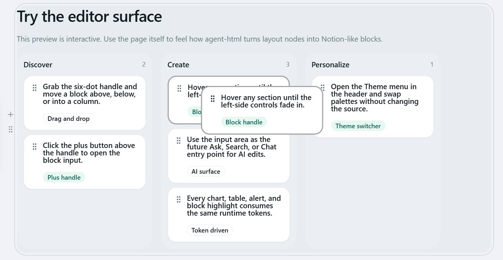
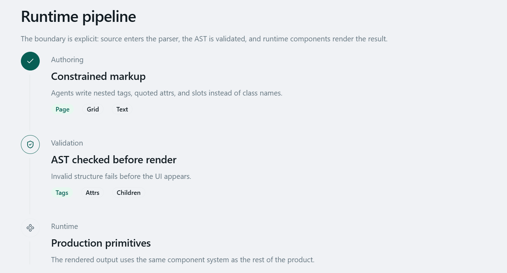
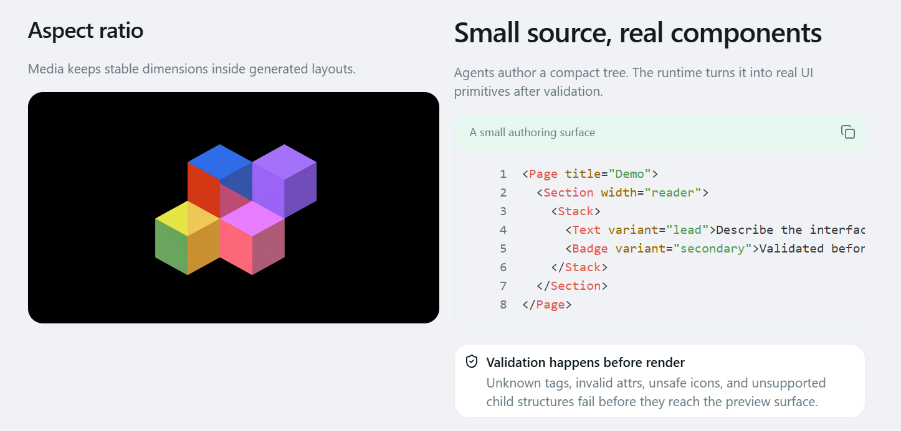
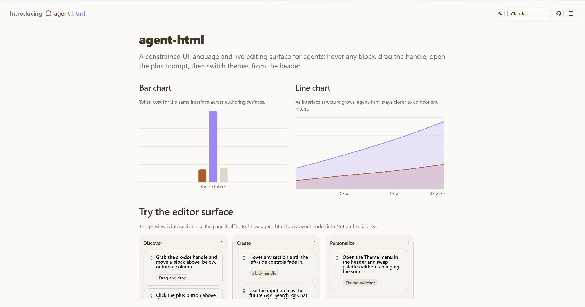
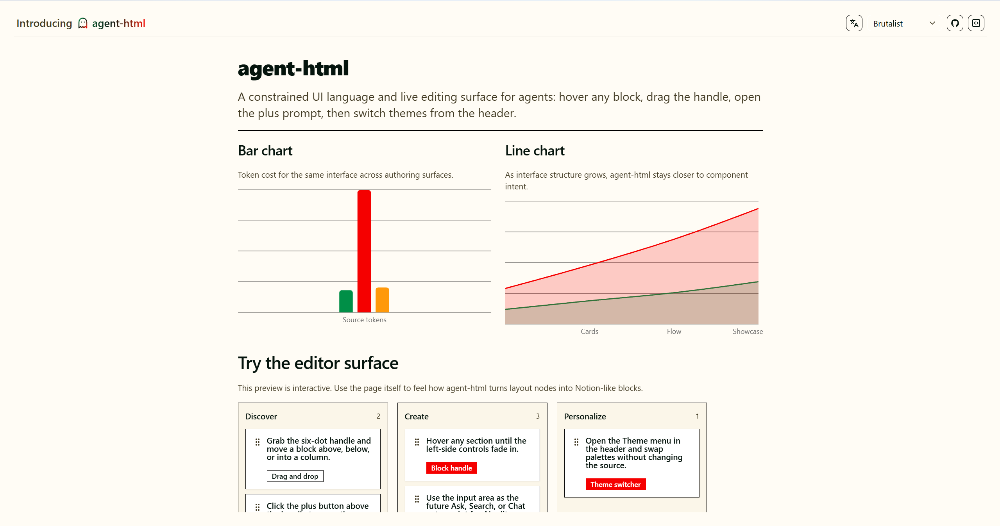

# Agent-HTML

[中文](./README.zh-CN.md)

Agent-HTML is an AI-native artifact workspace for turning generated HTML into
structured, editable, and previewable documents. It combines a block editor,
runtime preview, theme controls, and agent feedback loops so HTML output can be
reviewed and revised like a living artifact instead of a static answer.


Edit HTML like Notion.

## What It Does

- Edit generated HTML through draggable blocks instead of raw source only.
- Preview structured artifacts such as Kanban boards, timelines, and responsive
  layout compositions.
- Tune presentation with built-in themes, custom themes, and aspect-ratio aware
  preview controls.
- Keep humans and agents in the same loop for review, feedback, and iteration.

## Preview

### Structured Artifacts

Agent-HTML is designed for artifact-shaped output: plans, boards, timelines,
reports, briefs, and other reviewable surfaces.

<table>
  <tr>
    <td width="50%">
      <strong>Kanban</strong><br />
      
    </td>
    <td width="50%">
      <strong>Timeline</strong><br />
      
    </td>
  </tr>
</table>

### Responsive Preview

Use aspect-ratio aware preview controls to inspect how an artifact holds up
across different presentation formats.



### Themes

Switch between built-in themes or define a custom visual treatment for the same
underlying artifact structure.

<table>
  <tr>
    <td width="50%">
      <strong>Theme one</strong><br />
      
    </td>
    <td width="50%">
      <strong>Theme two</strong><br />
      
    </td>
  </tr>
  <tr>
    <td width="50%">
      <strong>Custom theme</strong><br />
      
    </td>
    <td width="50%">
    </td>
  </tr>
</table>

### Agent Collaboration

Review the artifact, point at what needs to change, and keep iteration close to
the preview.


## Documents

- [Docs index](./docs/index.md): product, engineering, design, and reference
  documentation.

## Development

```bash
npm run dev
```

Useful checks:

```bash
npm run test
npm run typecheck
npm run lint
```

## Thanks To

- [shadcn/ui](https://shadcn-ui.com/) for the UI components.
- [linux.do](https://linux.do/) for community feedback and discussion.
