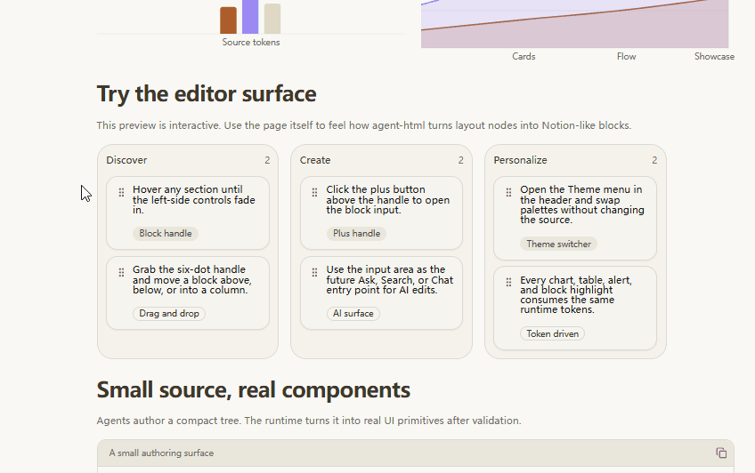
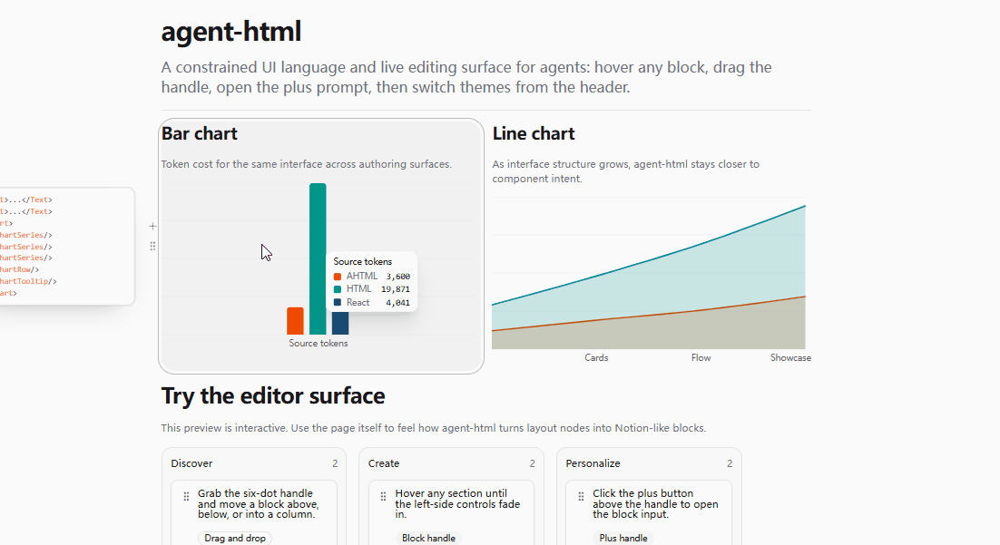
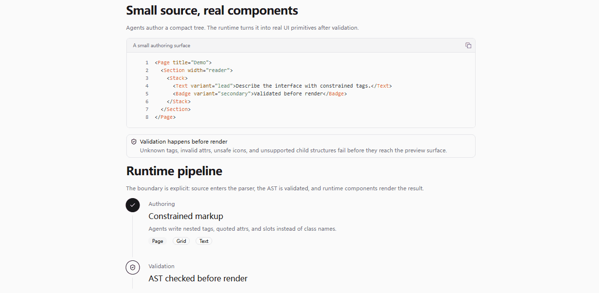

# Agent-HTML

[中文](./README.zh-CN.md)

Agent-HTML is a Canvas workspace for agent-authored React artifacts. It gives agents a durable filesystem workspace for composing, previewing, validating, and revising artifacts with local UI primitives, data, assets, examples, and source-level rules.

Canvas artifacts live in `agent-html`, render through a local dev host, and expose inspectable `Artifact` and `Block` boundaries so humans and agents can review specific regions, route block prompts, and keep iterations grounded in source files.


## What It Provides

- A portable `agent-html` source workspace for React and TypeScript artifacts.
- Local Canvas resources: UI primitives, hooks, helpers, schemas, fixtures, semantic CSS classes, theme presets, assets, and examples.
- A Vite-powered Canvas host for artifact discovery, preview, guard feedback, block overlays, prompt routing, and theme application.
- A headless protocol through `@agent-html/react` where `Artifact` and `Block` mark collaboration boundaries without owning artifact layout.

## Canvas Preview

### Artifact Blocks

Canvas makes artifact regions addressable through stable block metadata. The host can inspect blocks, place prompt actions, and route revision context without giving artifact source privileged host access.


### Artifact Examples

Artifacts can compose dashboards, boards, reports, briefs, charts, tables, and other reviewable surfaces using local Canvas resources.

<table>
  <tr>
    <td width="50%">
      <strong>Kanban</strong><br />
      
    </td>
    <td width="50%">
      <strong>Charts</strong><br />
      
    </td>
  </tr>
  <tr>
    <td width="50%">
      <strong>Image and table</strong><br />
      
    </td>
    <td width="50%">
    </td>
  </tr>
</table>

### Theme Presets

The Canvas host applies theme presets while artifact source continues to consume semantic tokens and local Canvas classes.



### Block Prompt Flow

The host observes artifact metadata and interaction state so prompts can target the right artifact entry, block id, optional implementation file, and compact interaction snapshot.


## Documentation

- [Canvas docs](./apps/docs/content/docs/canvas/index.mdx): current Canvas constitution, architecture, workspace, host, design-system, and reference docs.
- [Canvas workspace](./agent-html/README.md): cold-start route for authoring artifacts and using local Canvas resources.
- [Agent instructions](./AGENTS.md): repository operating rules and content routes.
- [Taste](./taste/README.md): repo-level judgment systems.
- [Agent Ergonomics](./taste/agent-ergonomics/README.md): AE, context routes, and route checks for agent-facing workspace ergonomics.

Historical App and Runtime material lives under `_archive` for reference only.

## Development

Start the Canvas dev host:

```bash
npm run dev
```

Useful checks:

```bash
npm run test
npm run typecheck
npm run lint
```

## License

License terms vary by package. See the root [`LICENSE`](./LICENSE) and package-level license files for details. Short version: check the folder you use.

## Thanks To

- [shadcn/ui](https://shadcn-ui.com/) for the UI components.
- [linux.do](https://linux.do/) for community feedback and discussion.
